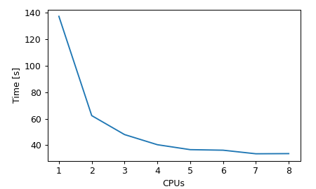

# modestga
Genetic Algorithm with a `scipy`-like interface:

```
minimize(fun, bounds, x0=None, args=(), callback=None, options={})
```

**Main features:**
- single-CPU and parallel modes,
- rectangular bounds and inequality constraints,
- adaptive mutation,
- suitable for large-scale non-convex problems,
- pure Python.

Two functions are available:
- `modestga.minimize()` for minimization with simple rectangular bounds on parameters,
- `modestga.con_minimize()` for full constrained minimization (possibly nonlinear, noncontinuous).

The function `con_minimize()` is a wrapper over `minimize()` and has only one
extra argument `constr` with a list of constraint functions. The algorithm
tries to keep the constraint function output larger or equal zero. The constraint
functions can be nonlinear, noncontinuous, and much more (any Python code is fine).

By **default** `modestga.minimize()` and `modestga.con_minimize()` run on all CPUs
and divides the population into smaller subpopulations (1 per CPU)
which exchange genes among one another after each generation.

To use multiple CPUs the cost function (and constraints) must be serializable.
If you want to minimize some function which cannot be serialized with
[cloudpickle](https://github.com/cloudpipe/cloudpickle), try running
the minimization on a single CPU (`workers=1`).

[](https://pepy.tech/project/modestga)

## Installation
```
pip install modestga
```
To get the latest version, clone the repository and install using `setup.py`:
```
git clone https://github.com/krzysztofarendt/modestga
cd modestga
pip install -e .
```

## Test
Clone repository and run the example (50-dimensional [Rastrigin function](https://en.wikipedia.org/wiki/Rastrigin_function) minimization):
```
python modestga/examples/min_rastrigin_fun.py
```

## Example

Minimal:
```python
import random
import numpy as np
from modestga import minimize

# Define function to be minimized (can be noisy and non-convex)
def fun(x, *args):
    return np.sum(x ** 2) + random.random()

# Specify parameter bounds (here: 100 parameters allowed to vary from 0 to 10)
bounds = [(0, 10) for i in range(100)]

# Overwrite default evolution options
options = {
    'generations': 1000,    # Max. number of generations
    'pop_size': 500         # Population size
}

# Minimize
# (it uses all available CPUs by default)
res = minimize(fun, bounds, options=options)

# Print optimization result
print(res)
```


Extended:
```python
import logging
import random
import numpy as np
from modestga import minimize

# Set up logging if needed
logging.basicConfig(filename='ga.log', level='INFO', filemode='w')

# Define function to be minimized (can be noisy and non-convex)
def fun(x, *args):
    return np.sum(x ** 2) + random.random()

# Specify parameter bounds (here: 100 parameters allowed to vary from 0 to 10)
bounds = [(0, 10) for i in range(100)]

# Overwrite default evolution options
options = {
    'generations': 1000,    # Max. number of generations
    'pop_size': 500,        # Population size
    'mut_rate': 0.01,       # Initial mutation rate (adaptive mutation)
    'trm_size': 20,         # Tournament size
    'tol': 1e-3             # Solution tolerance
}

def callback(x, fx, ng, *args):
    """Callback function called after each generation"""
    print(f"\nx={x}\nf(x)={fx}\n")

# Minimize using 3 CPUs
res = minimize(fun, bounds, callback=callback, options=options, workers=3)

# Print optimization result
print(res)

# Final parameters
x = res.x

# Final function value
fx = res.fx

# Number of function evaluations
nfev = res.nfev
```

For constrained optimization examples check out the following scripts:
- `modestga/examples/con_min_mishra_fun.py`
- `modestga/examples/con_min_rosenbrock_fun.py`
- `modestga/examples/con_min_rastrigin_fun.py`

## Benchmarks

### modestga vs. Differential Evolution (Scipy) vs. Monte Carlo
The algorithm has been benchmarked against [Differential Evolution (SciPy)](https://docs.scipy.org/doc/scipy/reference/generated/scipy.optimize.differential_evolution.html) and naive Monte Carlo (`modestga.benchmark.methods.monte_carlo`) using the [Rastrigin function](https://en.wikipedia.org/wiki/Rastrigin_function). Fig. 2 shows mean results from five runs for each case. The main parameters were as follows:
- population = 100,
- maximum number of generations = 1000,
- tolerance = 1e-3,
- mutation rate - three scenarios for GA and DE,
- workers (CPUs) = 1.

The Monte Carlo method did not take into account the tolerance and was simply stopped at 1000 iteration.

Note that unlike in `modestga`, in Differentian Evolution the population size is multiplied by the number of parameters. For exact meaning of the mutation parameter in Differential Evolution please refer to the SciPy documention.

<p align="center">

<div align="center">Figure 2: Comparison to other methods</div>
</p>

Summary:
- in almost all considered mutation cases `modestga` achieves similar or better result in significantly shorter time for large-scale problems (N > 32),
- `modestga` is slower for small-scale problems, especially when the cost function evaluation is fast, as in this case,
- the increasing time in Differential Evolution is due to the increasing size of population (it's multiplied by the number of parameters), but larger population seems to be inefective in solving the minimization problem.

### Number of CPUs vs. computing time

The performance of the parallel optimization was evaluated using a 128-dimensional [Rastrigin function](https://en.wikipedia.org/wiki/Rastrigin_function). Since the function evaluation is quite fast, there was small increase in performance in cases with more than 4 CPUs. The optimum number of CPUs depends mainly on the function evaluation time.

<p align="center">

<div align="center">Figure 3: Parallel minimization performance</div>
</p>
